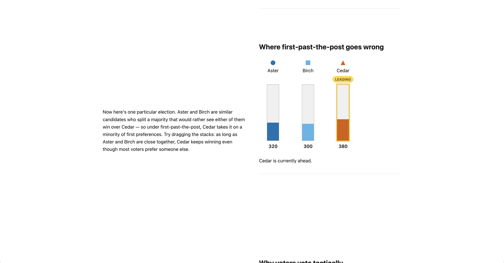
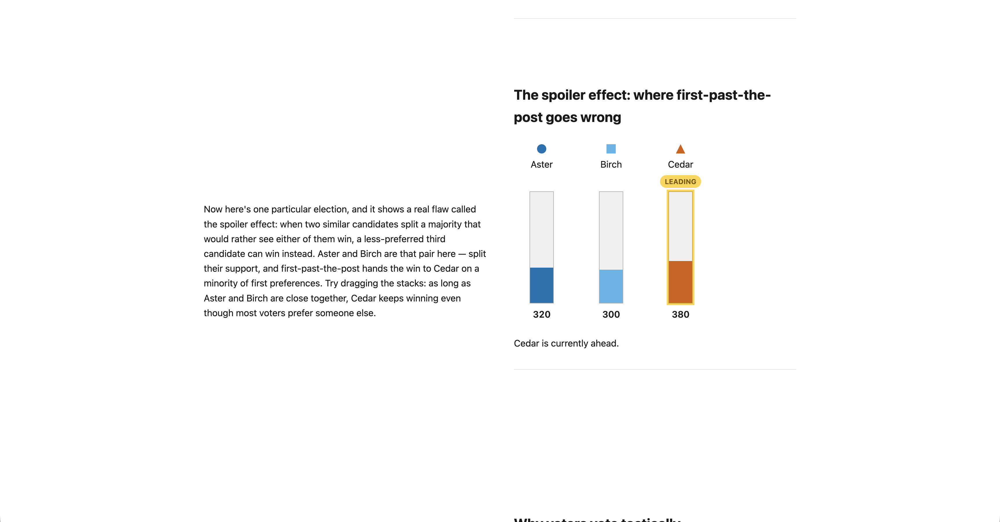
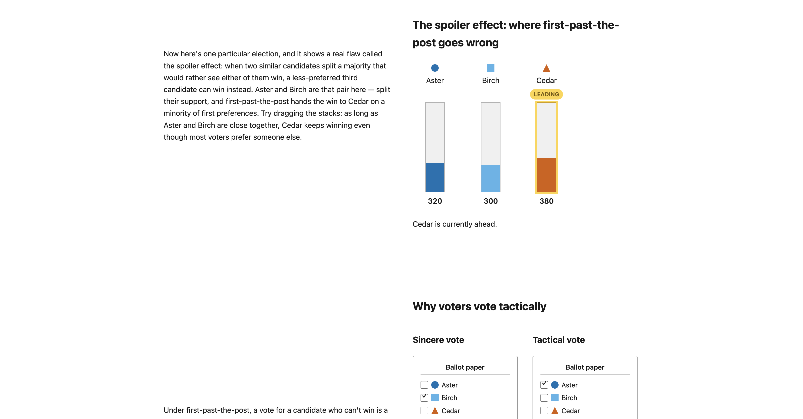
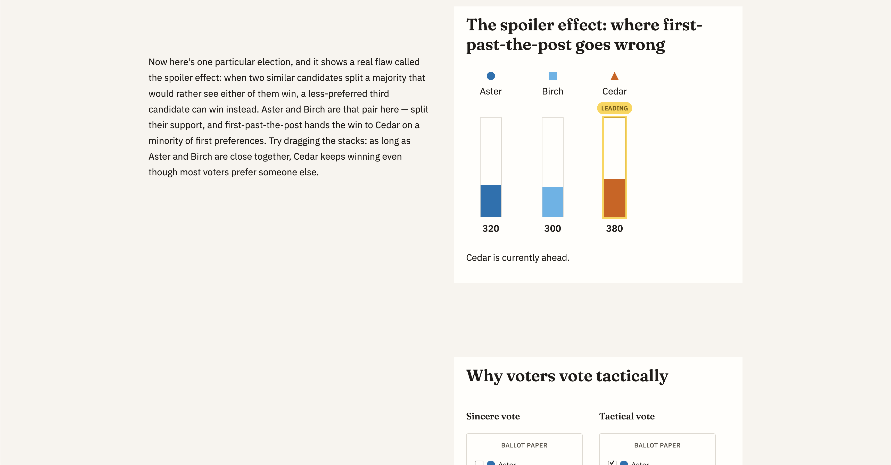

# Process overview

## What I built

I built a website with a storytelling structure that explains the first-past-the-post (FPTP) voting system, including its flaws, despite the fact that it is still used in many countries including the US, the UK, Canada, and India.
Then, it compares FPTP with preferential voting (a.k.a. instant-runoff voting, IRV), and how it resolves the aforementioned flaws with FPTP.
Ultimately, my aim is to show how the voting system itself, and not just the votes cast, can change who wins in an election.
The core interaction is the sticky visualisation design pattern, where there is a visualisation that is pinned to the viewport, and it is paired with scrolling text blocks to complement.
The visualisations can further be interacted with in different ways throughout the page.
For example, users can adjust a candidate's 'vote stack' and see how that changes the winner, across both voting systems, or specifically with IRV, users can step through the recounting rounds. 

## The moments that mattered

### Clarifying the storytelling structure, and audience

The prototype had reached a stage where the core of the explanations were all added, but the storytelling structure prompted from the beginning did not ultimately result in a coherent structure.
Specifically, the page lacked an introduction, a conclusion, and a clear but smooth transition point between the two voting systems, all of which would make the story feel more complete and cohesive.
Furthermore, some sections felt difficult to understand for those without background knowledge in voting systems or politics. For example, 

where the wording around the majority and minority feels clunky, the paragraph does not flow well, and there is a real effect behind the explanation, which is not named.

The obvious fix would have been to re-prompt to add an introduction, conclusion, and fix any unclear sections.
However, I may miss some sections, and future sections may not adhere to this requirement, creating inconsistency.
Instead, I prompted the agent to embed this requirement in `CLAUDE.md` to ensure all future prompts would continue to follow the cohesive storytelling structure ([`72ac3a0...b0a80da`](https://github.com/comp4020-agentic-coding-studio/comp4020-ass1-attwelveDev/compare/72ac3a0...b0a80da)):

> [...] Next, I want to write to CLAUDE.md to emphasise that this website follows a cohesive story structure. That means there should be an introduction with motivation to help a regular reader understand the context. There should also be a conclusion with key takeaways. Because the story is cohesive, make it clear, yet smooth that we are transitioning from one voting system to the next. Assume that the reader has no background knowledge in voting systems or politics, beyond possibly knowing what a voting ballot paper is. [...]

To confirm this change succeeded, I went through the page to ensure an introduction and conclusion had been added, along with explanations being easier to understand. For the same example as before,

where now the wording is significantly improved, and the name of the effect is clearly stated too.

This paid off later when I asked the agent to address how IRV mitigates FPTP's flaws in the IRV section, and it independently summarised this in the conclusion too, honouring the cohesiveness rule without being explicitly told to.

### Solidifying the visual language

Originally, the website had no personality, having quite a plain design.

The obvious fix would have been to simply give a solidified visual language description to Claude and ask it to build right away.
But this approach would only work for the current iteration, since there is no guarantee future changes would continue to adhere to this new design language.
So, I gave concrete design ideas to the agent, but also asked it to write the design elements to `CLAUDE.md`, and furthermore, add checks where applicable, as follows. 

> Let's now give the website a visual uplift. Write to CLAUDE.md the concrete styling we decide on, with checks where applicable too, before implementing the changes. I want a modern, professional, news-like design. Headlines should have a serif font and body should have sans, for editorial authority. Choose fonts with character and personality, rather than generic fonts. Colours should be non-partisan and neutral (avoid red/blue). If accent colours are needed, use sparingly to avoid confusion with the candidate colours. Have generous whitespace, with a narrower text column than the wider sticky visualisation to make the storytelling feel more premium. Whitespace between sections is important to let readers focus on one section at a time, and to soak in the details before moving onto the next sections. Ensure the layout grid, margins is consistent all throughout the website for cohesiveness. Feel free to add anything else that should be called out, and would fit with the design I've described so far.

This would mean that future changes and additions would continue to consistently adhere to this visual language.

After implementing the changes, the newly added checks passed, and I visually inspected the changes on both assessed viewports and ensured they met the descriptions I provided. There were minor issues after the redesign, including alignment inconsistencies and padding issues, which I resolved through further prompting.

Following all prompting, the redesign looked as follows ([`72ac3a0`](https://github.com/comp4020-agentic-coding-studio/comp4020-ass1-attwelveDev/commit/72ac3a0998182730427bbf1ae2ee6e4c8efffa50)).

### Emphasising the importance of animations on user experience

Adding realistic and reliable animations was perhaps the most difficult part of this process.
From early on I wanted to have the ballot paper from the ballot explainer section fly into the corresponding candidate stack in following section, to create a sense of harmony throughout the story.
For the IRV visualisations, I wanted votes to visually transfer from eliminated candidates to the next preferred candidate to help visualise the voting method. 
Through prompting, I encountered issues such as Claude creating a small ballot 'icon' that flies from explainer section instead of the real-size ballot paper flying in, and this icon would awkwardly remain visible on the candidate stack.
I felt this lacked realism and a sense of cohesiveness, and furthermore felt cheap. 
After further prompting to use a full-size card, the card was still not full-width, and would look unrealistic when scrolling back upwards.
Recognising that there is no standard for 'realism' or 'cohesiveness', even if this were fixed, further animations may also prove difficult to have a consistent style.
Hence, I prompted the agent to write in `CLAUDE.md` about the importance of animations, and set a standard for visual appeal and cohesiveness, and also write checks which should run until they are green. 

> Currently the animations are not perfect. Before you try to continue building to fix it, can we perhaps add a line to CLAUDE.md to address this? Animations should be tested thoroughly before it is considered "green". Animations should try to look smooth and not janky. Animations are a key part of this design to make this design stand out. Animations not just help add visual appeal, but should help convey information, like a ballot paper flying from one section to another, indicating they are related to each other. What do you think?

The agent subsequently added checks for the animations that I had described, which all failed at first, as expected.
Although this prompt forces Claude to continually write tests for animations from then onwards, which indeed passed with every iteration, Claude still took further prompting to eventually achieve clean animations ([`37379b0...f6b7e1c`](https://github.com/comp4020-agentic-coding-studio/comp4020-ass1-attwelveDev/compare/37379b0...f6b7e1c)).
On the upside, this means that by the end, the agent has developed an extensive suite of tests to ensure the animation works properly, and is able to hold up to future changes too.
Further to the checks, I visually inspected the animations on both assessed viewports to ensure they met my expections.